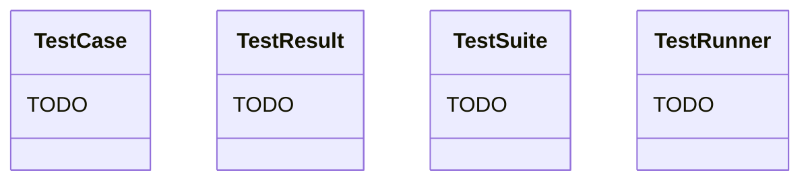

# Exercise: OOP — Build a Class Hierarchy

**Mode:** Hybrid (Design + Implementation)
**Duration:** 60–90 minutes
**Day:** Wednesday | **Week:** 1 — Git & Python Fundamentals

---

## Objective

By the end of this exercise, you will be able to:
- Design a class hierarchy with inheritance.
- Implement `__init__`, instance methods, class methods, and static methods.
- Use class attributes vs. instance attributes correctly.
- Apply OOP principles: encapsulation, inheritance, and polymorphism.

---

## Prerequisites

| Concept | Source |
|---------|--------|
| OOP Concepts | `written/3-Wednesday/oop-concepts.md` |
| Classes & Objects | `written/3-Wednesday/classes-and-objects.md` |
| Class Attributes & Methods | `written/3-Wednesday/class-attributes-methods.md` |
| The Object Class | `written/3-Wednesday/object-class.md` |
| Instructor Demo | `demos/3-Wednesday/INSTRUCTOR_GUIDE.md` (Demo 2) |

---

## The Scenario

You are building a **Test Management System** — a set of classes that model test suites, test cases, and test results. This is a simplified version of what frameworks like pytest do internally.

---

## Phase 1: Design (15 min)

Before writing code, sketch the class hierarchy. Use the blank template in `templates/class_hierarchy.mermaid` or draw on paper.

**Required classes:**
1. `TestCase` — represents a single test
2. `TestSuite` — a collection of test cases
3. `TestResult` — the outcome of running a test
4. `TestRunner` — executes a suite and collects results

**Questions to answer before coding:**
- Which attributes belong on the class vs. on the instance?
- What methods does each class need?
- Where does inheritance make sense (if anywhere)?

---

## Phase 2: Implementation (45 min)

### Task 1: TestCase Class (15 min)

Create `starter_code/test_management.py`:

```python
class TestCase:
    """Represents a single test case.

    Class Attributes:
        total_created (int): Count of all TestCase objects ever created

    Instance Attributes:
        name (str): Test name (e.g., "test_login_valid")
        description (str): What this test verifies
        priority (str): "high", "medium", or "low" (default: "medium")
        tags (list): Labels like ["smoke", "regression"]
    """
    # TODO: Implement __init__, run(), and a class method

    def run(self):
        """Simulate running the test. Return True for pass, False for fail.
        For now, use: return "fail" not in self.name
        """
        pass  # TODO

    @classmethod
    def from_dict(cls, data):
        """Create a TestCase from a dictionary.
        Example: TestCase.from_dict({"name": "test_login", "priority": "high"})
        """
        pass  # TODO

    @staticmethod
    def is_valid_name(name):
        """Check if name starts with 'test_' and has no spaces."""
        pass  # TODO
```

---

### Task 2: TestResult Class (10 min)

```python
class TestResult:
    """The outcome of running a single test.

    Instance Attributes:
        test_name (str): Which test was run
        status (str): "pass" or "fail"
        duration_ms (float): How long it took
        error_message (str or None): Error details if failed
    """
    # TODO: Implement

    def summary(self):
        """Return a one-line summary like: '✅ test_login (120ms)'"""
        pass  # TODO
```

---

### Task 3: TestSuite Class (15 min)

```python
class TestSuite:
    """A collection of test cases.

    Instance Attributes:
        name (str): Suite name
        tests (list): List of TestCase objects

    Methods:
        add_test(test): Add a TestCase
        remove_test(name): Remove by name
        get_by_priority(priority): Return tests matching the priority
        count(): Return number of tests
    """
    # TODO: Implement
```

---

### Task 4: TestRunner Class (15 min)

```python
class TestRunner:
    """Executes a TestSuite and collects results.

    Methods:
        run(suite): Run all tests in a suite, return list of TestResult
        summary(results): Print a formatted summary
    """
    # TODO: Implement

    def run(self, suite):
        """Run each test in the suite and return a list of TestResults."""
        import time
        import random
        results = []
        for test in suite.tests:
            start = time.time()
            passed = test.run()
            duration = (time.time() - start) * 1000
            # Simulate varying duration
            duration += random.uniform(50, 500)
            result = TestResult(
                test.name,
                "pass" if passed else "fail",
                round(duration, 1),
                None if passed else f"{test.name} assertion failed"
            )
            results.append(result)
        return results
```

---

## Phase 3: Putting It All Together

Create a `main()` function that:

1. Creates 6+ TestCase objects (mix of passing and failing names).
2. Uses `TestCase.from_dict()` for at least 2 of them.
3. Creates a TestSuite and adds all tests.
4. Uses `get_by_priority("high")` to list high-priority tests.
5. Runs the suite with TestRunner.
6. Prints the results summary.

---

## Deliverables

### Template File

`templates/class_hierarchy.mermaid` — fill this in during Phase 1:



---

## Stretch Goals

- [ ] Add a `@property` for pass_rate on TestSuite.
- [ ] Add a `ParameterizedTestCase` subclass that holds input data.
- [ ] Implement `__len__` on TestSuite so `len(suite)` works.
- [ ] Add a `to_json()` method on TestResult using the `json` module.

---

## Definition of Done

- [ ] Class hierarchy diagram completed (mermaid or on paper).
- [ ] `TestCase` has `__init__`, `run()`, `from_dict()`, and `is_valid_name()`.
- [ ] `TestResult` stores status and provides a `summary()` method.
- [ ] `TestSuite` supports add, remove, filter by priority, and count.
- [ ] `TestRunner` executes a suite and returns results.
- [ ] A `main()` function demonstrates the full workflow.
