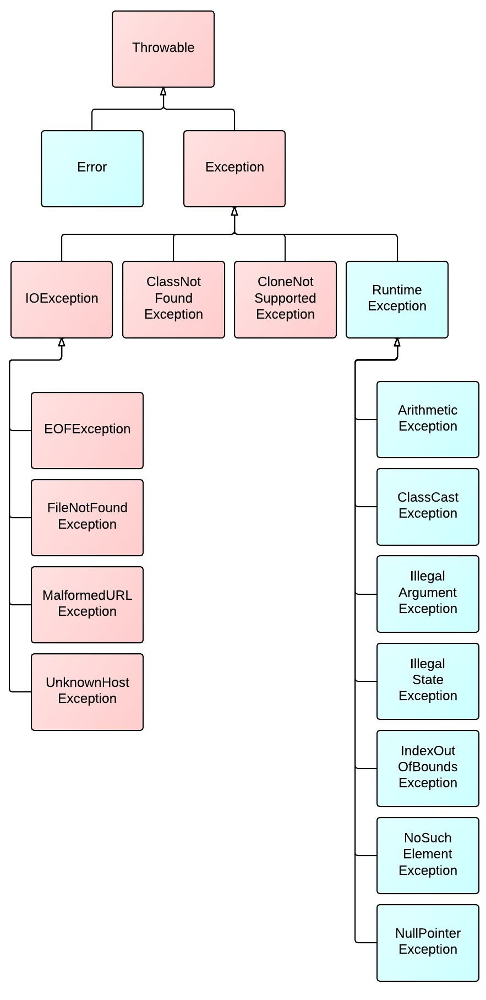
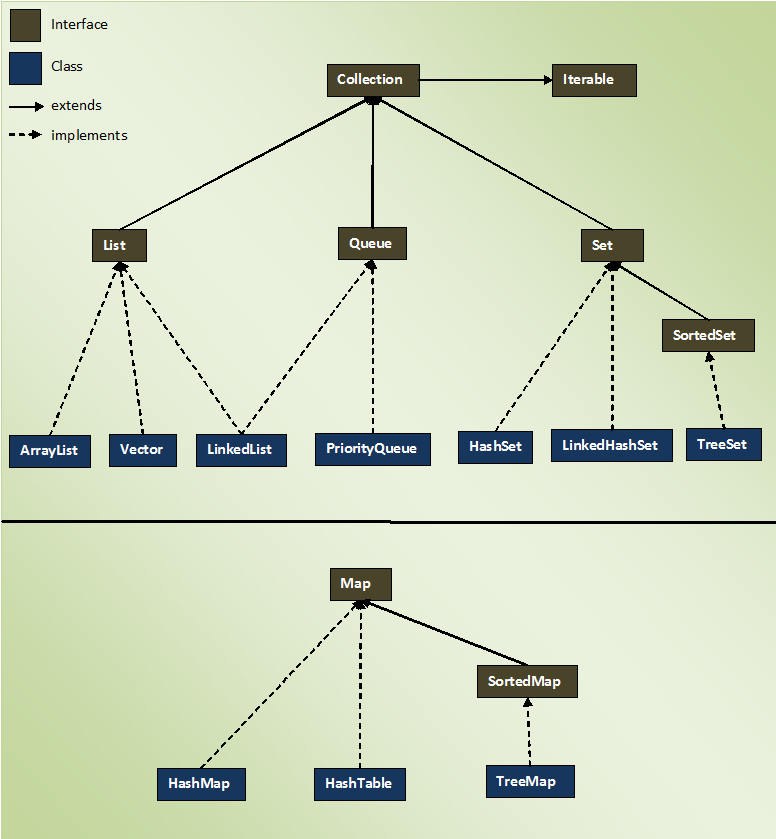

# Java Slim Study Guide

## Java Orientation

### Big Picture: Full Stack Architecture
**Full stack technology** encompasses the entire scope of a computer system application, with **full stack developers** proficient in both **front end** and **back end** development. The front end involves everything a client interacts with, typically built using **HTML**, **CSS**, and **JavaScript**, or through content management systems like WordPress. Conversely, the back end includes servers, databases, and internal architecture that support the application, which the end-user doesn't directly interact with. **Front end developers** optimize visible parts for web browsers and mobile devices, while **back end developers** refine the software code that communicates with servers and databases. **Full stack developers**, skilled in both areas, are versatile and can handle both front and back end tasks within a development team

### What is Java
Java is a **high-level** programming language that features **automatic memory management**, eliminating the need for developer pointers and handling garbage collection. It is a **compiled** language, meaning the source code is compiled together before execution. Java is **statically typed**, requiring variable types to be declared, and **strongly typed**, preventing data type coercion. As an **object-oriented programming (OOP)** language, it utilizes classes and objects. Java's **Write Once, Run Anywhere** capability allows any application to run on any system with a JRE and JVM. Additionally, Java benefits from a **rich open source community**, providing a vast array of libraries for developers to integrate into their programs.

### JVM, JRE, JDK
Most Java applications only require the **JRE** (Java Runtime Environment). But to write and compile code you need the **JDK** (Java Development Kit). While the JRE provides Java's standard libraries and exceptions as well as a **JVM** (Java Virtual Machine), the **JDK** provides all the above as well as **javac**, the compiler. Java source code is written in text files labeled with **.java** extension. It is then compiled into bytecode in **.class** files by the compiler. Then the bytecode is executed by the **JVM**, which translates the Java commands into low-level instructions to the operating system.

Since Java 6, all Java programs not run inside a container (such as a Servlet Web Container) start and end with the main method. The class containing the main method can have any name, but the method itself should always be named **main**

```java
class Example {
    public static void main(String[] args) {
        System.out.println("Num args:" + args.length);
    }
}
```

- *public* is a Java access modifier keyword that means the `main` method can be accessed from any method during the program's execution
- *static* is a Java keyword that means the method can be invoked without creating an instance of the class that contains it, making it a global method
- *void* is a Java return type keyword that means the method doesn't return any values of any data type
- *args* is a Java variable of type String array which means the method can take command line arguments as an array of Strings

To compile Java code into a **.class** file, use:
> `javac Example.java`

To run the resulting **Example.class** file, use:
> `java Example`

The **java** and **javac** commands require the full directory path or class path to any source code or binary file. For a package **com.demo** in the first line of Example, nest the Java file into a **com/demo/** directory and run:
> `javac com/demo/Example.java`  
> `java com.demo.Example`

You can add packages and imports to expand the application into a set of interacting objects. By default, the **javac** compiler implicitly imports several base packages from the standard library. The **-help** flag displays available options. For example, to compile using UTF-8 encoding while conforming to Java 1.8 features, use:
> `javac -encoding UTF-8 -source 8 -target 8 Example.java`

## Java Basics

### Classes & Objects
In Java, a **class** is a template used to instantiate **objects** and is also referred to as a **type** when used with a **reference variable**. A **class** determines the state and behavior of an **object** and what behaviors can be invoked through a **reference variable**. An **object** is an **instance** of a **class** in memory, and you interact with it through its reference, which is the memory address used by the JVM

|class|object|
|-----|------|
|declared using class keyword| declared using new keyword|
|declared once|declared as many times as needed|
|no memory allocated when created|memory allocated when created|
|blueprint for creating objects|instantiated class|

### Primitive Data Types
Java handles two kinds of data types: **primitives** and **references**. **Primitives** are variables that store simple values. There are eight in Java:
- Integer types: **byte**, **short**, **int**, and **long**
- Floating-point types: **float**, and **double** 
- Logical types: **boolean**
- Character type: **char**

### Reference Variables
A **reference variable** stores the reference to an object in memory. The type of a **reference variable** determines what types of objects it can store a reference to and what behaviors can be invoked. For example, in the line `String someVar = new String("Hello World");`, `String` is the class/type, `someVar` is the **reference variable**, and `new String("Hello World")` is the instantiation of a new object. The **reference variable** `someVar` does not contain the object itself but a reference to it in memory. The `String` type means `someVar` can only store a reference to a `String` object and can only invoke methods or access public variables present in the `String` class

### Arrays
An **array** in Java is a contiguous block of memory storing **elements** of the same type, declared with square brackets after the type. **Arrays** are fixed in size and cannot be resized after declaration. For example:
```java
int[] myInts = new int[]{1, 2, 3, 4};
String languages[] = {"Java", "JavaScript", "SQL"};
```
Each item in an array is called an **element**, and all **elements** must be of the same type. **Elements** are accessed via their **index**, starting at `0`. For instance:
```java
String myElement = languages[0];
```
Arrays have a `length` property useful for iteration:
```java
String[] myArr = {"first", "second", "third"};
for (int i = 0; i < myArr.length; i++) {
  System.out.println(myArr[i]);
}
```
Keep in mind **arrays** are objects, and you can refer to the entire **array** by its name without brackets

### Control Flow: Conditional Statements

#### If Statements
The `if` statement in Java relies on **Boolean expressions**, which return either **true** or **false**. If the expression is **true**, a statement or block of statements is executed. The `else` and `else if` statements provide alternate execution paths if the Boolean expression is **false**. Boolean expressions often involve comparing variables using **relational operators** like `==`, `!=`, `<`, `<=`, `>`, and `>=`. Here's the basic syntax:
```java
if (condition) {
  statement1;
} else if (condition2) {
  statement2;
} else {
  statement3;
}
```

#### Switch Statements
The `switch` statement offers a more concise solution than large chains of `else-if` statements for selecting actions based on a variable's value. It works with `byte`, `short`, `char`, `int` primitives, `enums`, and `Strings` (since Java 7). The basic syntax is:
```java
switch(variable) {
  case 'A': System.out.println("Case A matches!"); break; 
  case 'B': System.out.println("Case B matches!"); break;
  case 'C': System.out.println("Case C matches!"); break;
  default: System.out.println("This will run if other cases don't match"); break;
}
```
The `break` statement ensures that only the code for the matching case executes, though you can allow control flow to "fall through" to the next case

### Control Flow: Loops
**Loops** are essential for programs that repeatedly get input, process it, and then get more input. Like `if` statements, loops use **conditional expressions** to determine when to stop. Java provides several keywords for different looping scenarios: `for`, `while`, and `do-while`

**For-loops** are used for iteration, often with data structures, and include a declaration, condition, and increment/decrement statement
```java
for (int i = 0; i < myData.length; i++) {
  System.out.println(myData[i]);
}
```
**Enhanced for-loops** iterate over objects implementing the `Iterable` interface:
```java
List<String> myList = getListOfStrings();
for (String myStr : myList) {
  System.out.println(myStr);
}
```
**While statements** test a condition and loop as long as it remains `true`:
```java
while (true) {
  // infinite loop!
}
```

**Do-while loops** guarantee the block runs at least once, checking the condition after the block:
```java
do {
  // always runs at least once!
} while(condition);
```

Java’s `break` and `continue` statements control the flow of a program. `Break` exits the current control flow, while `continue` skips to the next iteration of a loop

### Operators
Java offers various operators, including the **assignment operator** (`=`) which assigns a reference variable to a primitive value or object

##### Increment and Decrement Operators
To increment or decrement integral values, use **postfix** operators: `x++` and `x--`, where `x` is a `byte`, `short`, `int`, or `long`. The **prefix** increment or decrement operators are `++x` and `--x`. The prefix operator changes the value before the rest of the expression is evaluated, while the postfix operator changes the value after the entire expression is evaluated
```java
int a = 5;
int b = a++; // assign b=5, then increment a to 6
int c = ++a; // increment a to 7, then assign c=7
System.out.println(a); // 7
System.out.println(b); // 5
System.out.println(c); // 7
```

#### Ternary Operator
The **ternary operator** uses the syntax: `x = condition ? expr1 : expr2`. If the condition is true, `x` is assigned the value of `expr1`; if false, `expr2` is assigned.

```java
boolean skyIsBlue = true;
boolean twoAndTwoIsFour = true;
boolean makesSense = (skyIsBlue && twoAndTwoIsFour) ? true : false;
```

### Comparison Operators
Boolean expressions can be complicated; however, frequently they involve the comparison of the value of one variable to another value, which could be another variable, a literal, or even an arithmetic expression. This comparison uses one of the **relational operators** listed below. All of these operators are **binary operators** which means they work on two operands, one to the left of the **relational operator** and one to the right of the **relational operator**
|Operator|Description|
|--------|-----------|
|==      |Returns **true** if the expression on the left evaluates to the same value as the one on the right|
|!=      |Returns **true** if the expression on the left does not evaluate to the same value as the one on the right|
|<       |Returns **true** if the expression on the left evaluates to a value that is less than the one on the right|
|<=      |Returns **true** if the expression on the left evaluates to a value that is less than or equal to the one on the right|
|>       |Returns **true** if the expression on the left evaluates to a value that is greater than the one on the right|
|>=      |Returns **true** if the expression on the left evaluates to a value that is greater than or equal to than the one on the right|

### Logical Operators
There are a few logical operators you should be aware of: **`&&`** is the logical **AND** operator. It compares two boolean values. If both are true, the expression becomes true. Otherwise, the expression becomes false. The logical **OR** operator **`||`** compares two boolean values: if **either** of the values are true, the expression evaluates to true. Otherwise, the expression is false. Finally, the logical **NOT** operator **`!`** reverses the state of the boolean - so true becomes false and false becomes true:
```java
boolean a = true;
boolean b = false;
if (!(a && b)) {
  System.out.println("a and b are NOT both true");
}
```
We use parenthesis to prioritize the expression **`a && b`**, which returns false. We use the **`!`** operator to reverse the **false** value to **true**. So the if statement's condition is true and the print statement is executed

### Commenting
In Java, **`//`** is used for single line comments, which are useful for quick notes. For multi-line comments, **`/* */`** is used, allowing comments to span multiple lines. Additionally, multi-line comments can be used to create Javadocs:
```java
/**
 * This method performs a specific operation.
 *
 * @param param1 This is the first parameter.
 * @param param2 This is the second parameter.
 * @return This returns a result based on the operation.
 * @throws IllegalArgumentException If the input parameters are invalid.
 * @exception NullPointerException If any of the parameters are null.
 * @see AnotherClass#anotherMethod()
 * @deprecated This method is deprecated and will be removed in future versions.
 * @since 1.0
 * @author Your Name
 * @version 1.2
 * {@link AnotherClass#anotherMethod()}
 * {@code int result = exampleMethod(param1, param2);}
 */
public int exampleMethod(int param1, int param2) {
    // Method implementation here
    return param1 + param2;
}
```
Once your comments are ready, you can use the `javadoc -d doc/path *.java` command to generate html documentation for your code located in your doc path. If you don't want to generate the documentation for all files you can specify the files you want documentation for

### Packages and Imports
A **package** is a collection of classes, interfaces, and enums organized in a hierarchical manner. **Packages** enable you to keep your classes separate from the classes in the Java API, allow you to reuse classes in other applications, and distribute your classes to others:
```java
package com.revature.mypackage;
```
This line declares the **package** in which the class will reside. This must always be the first (non-commented) line in a `.java` file. **Packages** follow a naming convention of lowercase characters separated by periods in the reverse way you would specify a web domain: `com.revature.mypackage` instead of `mypackage.revature.com`. Classes can be referenced anywhere in a program by their "fully qualified class name," which is the package declaration followed by the class, to uniquely identify the class. Typically, we do not want to write out a verbose package and class name together. Instead, we can use an `import` statement after our package declaration to pull in other classes. We can then just use the class name without the package. By default, everything in the \`java.lang\` package is imported. Other packages and classes must be imported by the programmer explicitly:
```java
package com.revature.mypackage;
import java.util.Scanner;
```

### Debugging
- **Compile/Run Your Code More Often**: This is the most important advice, especially for beginners who write large quantities of code before compiling. When you run your code frequently and test it, you get feedback and can check whether you are going in the right direction 
**Use Print Statements Effectively**: One of the simplest and favorite tools for every programmer, especially beginners, to debug code. Most debugging issues can be solved by inserting print statements in your code. Print out variables and check your console for correct values. Also, inspect values when possible
- **Research Your Error Online**: The simplest thing you can do is copy the error message and google it. There is a good chance you will find your answer on StackOverflow (the largest community for developers) or other forums or communities
- **Try Alternate Solutions**: Try different solutions when you don’t understand the cause and don’t know how to fix the problem. If it’s still not working, try another one. Possibilities are that you get the solution but encounter a new error. Don’t panic in this case and accept that every developer goes through this phase
- **Use Comments Effectively**: In any language, comments are not just to leave a note in the code or to explain the code. You can also use them to debug by temporarily commenting out a piece of code that you don’t need to run at that time and isolate other parts of the code to execute
- **Use Binary Search**: Finding a complex error in a buggy file is really difficult, especially when it has thousands of lines of code. In those cases, you need to check more and more places. To avoid this, the best thing you can do is apply binary search. Divide the code into two parts. Comment out one part and run the other part. Whatever part is responsible for the error, repeat the division process with that part and keep repeating it until you find the line(s) that produce the error
- **Use Debugging Tools**: Many development environments come with debugging tools like Visual Studio Code and Eclipse. These tools can pause execution and inspect data values line by line
- **Automated Tests**: Automated tests and other unit tests are performed to check if the actual output matches the expected output. This is done by writing test scripts where we execute the software with specific input
- **Ask for Help**: If you have tried everything to find the bug and resolve it but nothing is working, you need to ask someone for help. Asking for help often yields a solution you might not have considered before

## Methods

### Method Declaration & Syntax
A **method** is a block of reusable code with three key parts: the **method name**, which is a unique identifier, the **method parameters**, which are variables passed inside the parentheses and used within the method, and the **return type**, which is the data type returned by the method. For example, in the method 
```java
int addNumbers(int num1, int num2) {
    return num1 + num2;
}
``` 
"addNumbers" is the **method name**, `num1` and `num2` are the **method parameters**, and `int` is the **return type**, indicating a whole-number value must be returned. If no value needs to be returned, the `void` keyword is used. The standard naming convention for **methods** is to make the name an action and to use camelCase notation

### Varargs (Variable Arguments)
Java allows you to pass a variable number of arguments to a method using varargs. This is useful when you don't know how many arguments will be passed to the method. Varargs are specified by three dots (`...`) after the data type. Inside the method, a varargs parameter is treated as an array
```java
int sumNumbers(int... numbers) {
    int sum = 0;
    for (int num : numbers) {
        sum += num;
    }
    return sum;
}
```
In this method, `sumNumbers` can accept any number of `int` arguments. The `numbers` parameter is treated as an array within the method

### Method Invocation
The following class has a method that will return the sum of two integers:
```java
public class Main{
  public static void main(String[] args){

  }
  int addNumbers(int num1, int num2){
    return num1 + num2
  }
}
```
to actually use the method an object of the Main class has to be instantiated, and then the **dot operator** used to call the method:
```java
public class Main{
  public static void main(String[] args){
    Main obj = new Main();
    obj.addNumbers(1,2);
  }
  int addNumbers(int num1, int num2){
    return num1 + num2
  }
}
```

### Method Visibility Modifiers
An optional addition for creating methods is adding a **visibility modifier**. These keywords are used to control where the methods you create can be accessed:
|modifier|access|
|-------|-------|
|public|anywhere|
|protected|within same package and sub-classes|
|default (no keyword)|within same package|
|private|within same class|
```java
// this method can only be used in the class where it is defined
private int addNumbers(int num1, int num2){
  return num1 + num2
}
```

### Method Scope
Methods can exist in one of two scopes: the **instance scope** and the **class scope**. Methods exist in the **Instance Scope** by default: they are accessed using the dot operator with an instantiated object:
```java
Main main = new Main();
main.addNumbers(2,3);
```
Methods can also exist in the **class scope** by adding the **static** key word to the method. This makes the method belong to the class instead of the objects of the class, so internally they can be referenced directly, and outside of the class they are referenced using the dot operator and the Class:
```java
public class Main{
  public static int addNumbers(int num1, int num2){
    return num1 + num2;
  }
  public static void main(String[] args){
    addNumbers(1,2);
  }
}
```
```java
public class App{
  public static void main(String[] args){
    Main.addNumbers(1,2);
  }
}
```

### The Stack & Heap
When running an application, the JVM divides memory into **stack** and **heap memory**. When we declare new variables, objects, call methods, or perform similar operations, the JVM allocates memory from either **Stack Memory** or **Heap Space**

**Stack Memory** in Java is used for static memory allocation and thread execution. It contains primitive values specific to a method and references to objects in the heap. Access is in **Last-In-First-Out (LIFO)** order. A new block is created on top of the stack for each method call, containing method-specific values. When the method finishes, its stack frame is flushed, and space becomes available for the next method. Stack memory grows and shrinks with method calls, is automatically allocated and deallocated, and is threadsafe. If full, Java throws `java.lang.StackOverFlowError`

**Heap Space** is used for dynamic memory allocation of Java objects and JRE classes at runtime. New objects are created in heap space, with references stored in stack memory. Objects in heap space have global access, meaning as long as there are references to the object it can be accessed. If heap space is full, Java throws `java.lang.OutOfMemoryError`. Access to heap memory is slower than stack memory, and it requires a **Garbage Collector** for deallocation. Unlike stack memory, heap memory is not threadsafe and needs proper synchronization

### Method Recursion
Because methods are references to reusable code, you can call a method within itself: this is called **method recursion**:
```java
public int overEngineeredCounter(int current, int target){
  if (current <= target){
    System.out.println(current);
    overEngineeredCounter(++current, target);
  }
}
```
The method above calls the `overEngineeredCounter` method recursively to print the values of current until it prints the target value, then it ceases calling itself

## Types

### Wrapper Classes
**Wrapper classes** are the object versions of primitives. There are many methods that require the use of objects for them to function; **wrapper classes** allow primitives to be passed in as arguments for those methods. Java can handle much of this logic for you through the use of **autoboxing**. **Autoboxing** is Java's ability to convert a primitive to its class form, called **boxing**, and converting an object version of a primitive into its primitive form, called **unboxing**
```java
public static void main(String[] args){
    int x = 5;
    needObject(x)// will print 10, x will be boxed into its wrapper class
}
public static void needObject(Integer num){
    System.out.print(num + 5);
}
```

### Strings
**Strings** are immutable objects in Java. They have a pool (**string pool**) in the heap that allows for multiple references to point to the same **String** object. This makes them work a little differently from other objects
```java
// these two strings point to the same object in memory, return true when the .equals() method is called
String myString = "this is a valid way of declaring a string";
String myStringTwo = "this is a valid way of declaring a string";
System.out.println(myString.equals(myStringTwo)); // returns true

// using the new keyword will create a new instance of the string in the pool
String myString = "this is a valid way of declaring a string";
String myStringTwo = new String("this is a valid way of declaring a string");
System.out.println(myString.equals(myStringTwo)); // returns true, compares content
System.out.println(myString == myStringTwo);// returns false, compares memory location of objects 
```
If you need to make changes to a **String** like object you can use a **StringBuilder** instead. **StringBuilder** objects have access to many helper methods, such as `append`, `replace`, `reverse`, and `delete`. These methods and the others in **StringBuilder** affect the object in place instead of requiring a whole new object to be made. If you need a thread safe option you can use a **StringBuffer** instead of a **StringBuilder**
| Class | Immutable? | Thread-safe? | Speed |
| ----  | ---------- | ------------ | ----- |
| String | Y | Y | Slowest |
| StringBuilder | N | N | Fastest |
| StringBuffer | N | Y | Fast |

## Exception hierarchy

## Exception Handling/Declaring
Java throws exceptions when they occur. If no code is provided to handle the exception it will go all the way to the JVM and the JVM will terminate the program. You can handle exceptions as the developer by using try/catch blocks, similar to if/else blocks. This is called handling. You can also "duck" or declare exceptions by adding a throws clause to your method signature. This allows you to throw checked exceptions without catching it in the method
```java
// try to be specific with exceptions when possible
public static void duckMethod() throws Exception{

}
```
## Custom Exceptions
You can create custom exceptions relatively easily. Create a class, extend either exception or runtime exception (or a more specific exception) add a constructor that has a message parameter, and in the constructor call super(argument). You're done
```java
class MyCheckedException extends Exception{
    public MyCheckedException(String message){
        super(message);
    }
}
class MyUncheckedException extends RuntimeException{
    public MyUncheckedException(String message){
        super(message);
    }
}
```
## Checked vs Unchecked Exceptions
checked exceptions need to be in try catch blocks, unchecked do not. If you add throws to a method signature you can list any checked exceptions and throw them without a try catch block.
```java
try{
    throw new MyCheckedException("this message shows when the exception is thrown");
} catch (MyCheckedException exception){
    exception.printStackTrace();
} finally{
    // Anything you want to happen, whether an exception is caught or not, can go in a finally block
}

if (2 > 1){
    throw new MyUncheckedException("you don't need to handle this with a try catch");
}

public static void throwsMethod() throws MyCheckedException{
    throw new MyCheckedException("I can do this without a try catch block");
}
```

## Java Class

### Introduction to OOP
Although Java accommodates several paradigms, **Object Oriented Programming (OOP)** is the foundation for most Java applications. In **OOP**, a program is organized into objects encapsulating related fields (representing its **state**) and methods (representing the class's **behavior**). When defining objects, Java reserves the keyword **`class`** (not to be confused with the **.class** file extension) which serves as their blueprint. An object in Java represents an instance in memory of a class, and also every class implicitly inherits from the **Object** superclass which provides useful convenience methods such as **equals()** and **toString()**. Java popularized several 'Pillars' of **OOP** design theory. While the numbers vary between OOP languages, Java focuses on four:

- **Abstraction** By simplifying objects to a set of useful features, we hide irrelevant details, reduce complexity, and increase efficiency. Abstraction is important at all levels of software and computer engineering, but essential to designing useful objects. Complicated real-world objects are reduced to simple representations

- **Encapsulation** Objects should group together related variables and functions and be in complete control over them. So the state of an object should only change, if ever, through the object itself. Also known as data hiding, because the object has sole responsibility for its fields, and no outside object or function should interfere

- **Inheritance** Code reuse is an important principle of programming (DRY - Don't Repeat Yourself), and new classes can reuse code from existing ones. This establishes a superclass-subclass (or parent-child) relationship where the derived classes inherit (and sometimes change) fields and methods from its parent

- **Polymorphism** With inheritance, an object of a derived class can be referenced as instances of its parent class. This provides flexibility when invoking inherited methods with varying implementations in derived classes. Also, even without inheritance, behavior in a class can change depending on the signature of the methods contained

### Class Members: Fields, Constructors, Methods
The state of a class/object is represented by its **fields**: these are references to the data that encompass the entity. These resources are what are used to represent your data in your code. **Constructors** are special **methods** that are called when you instantiate an object of a class. They share the name of their class and declare no return type. These methods are used to set initial values for the instantiated object of the class, perform any setup actions, or trigger actions upon object creation. Finally, classes have regular **methods**: repeatable code that is associated with the class/objects of the class
```java
public class Person{
  // these are fields of the class
  String name;
  int age;

  // this is a constructor: it requires a string and int that will be set for the fields of the object made
  public Person(String name, int age){
    // this.name is a reference to the field of the class
    // name is a reference to the parameter
    this.name = name;
    this.age = age;
  }

  // this is a method: objects of the class can use it
  public void giveGreeting(){
    System.out.println("Hello there!");
  }
}
```

### Static Members
Sometimes you will want members of a class (fields and methods) to belong to the class itself directly, instead of belonging to objects of the class. The **static** keyword can be used for both methods and fields in a class, which changes the **scope** of the resource. **Scope** in programming defines the accessibility of variables and methods. There are four main types of scope:
- **Class/Static Scope**: Available to all instances of a class by invoking the class itself. The **static** keyword makes a variable class scope. Class scope methods/variables cannot interact with instance variables/methods
- **Instance/Object Scope**: Available to the instance of an object, using the **this** keyword to interact with instance variables. Instance variables are unique per object and do not cross objects.
- **Method Scope**: Available within the method it is instantiated in, and the variable no longer exists after the method is finished
- **Block Scope**: Available within the `{}` it is instantiated in, usually used in control-flow statements
``` java
public class MyClass{

    static int classCount = 0; // class scope: available to all myClass objects, should be referenced by the class directly
    String objectName; // instance scope: each object of this class will have their own objectName field

    public MyClass(String objectName){
        int addOneToClass = 1; // method scope: only available within this method
        MyClass.classCount += addOneToClass;
        this.objectName = objectName;
    }

    public static void countClass(){
        if (MyClass.classCount == 0){
            int zero = 0; //block scope: only exists for the execution of this block of code
            System.out.println(zero);            
        } else {
            System.out.println(myClass.classCount);
        }
    }
}
```

### Polymorphism
**Polymorphism** is the ability for the behavior of a class to take on many forms: the two ways this is achieved is through **Overloading** and **overriding**. **Overloading** is a form of **compile-time polymorphism** where multiple methods can share a name but have different parameters to distinguish them. This can be particularly useful if you need to perform a similar action on different types of data, but want a unified way of performing your action:
```java
// this prints the sum of the numbers
public void combine(int num1, int num2){
  System.out.println(num1 + num2);
}
// this concatenates the words provided
public void combine(String word1, String word2){
  System.out.println(word1 + word2);
}
```
When **overloading** a method you can also change the declared return type

**Overridding** is a form of **run-time polymorphism** where a child class changes the implementation of an inherited method. This is useful when a behavior is shared among many classes, but some of those classes require a unique implementation of the behavior:
```java
public class Vehicle{
  public void drive(){
    System.out.println("vroom vroom!");
  }
}

public class Car extends Vehicle{}

public class Truck extends Vehicle{}

public class Bike extends Vehicle{
  @override
  public void drive(){
    System.out.println("ding ding!");
  }
}
```

### Inheritance
**Inheritance** is the ability for child resources, such as classes, to receive members from a parent resource, typically fields and methods. Regular classes can inherit from one other regular class using the **extends** keyword: Java does not support multiple class inheritance. Often, however, **abstract classes** and **interfaces** are used to facilitate **inheritance**

#### Abstract Classes
**Abstract classes** have two distinguishing differences from regular classes: objects can not be directly instantiated for **abstract classes**, and they are allowed to have **abstract methods**. Because **abstract classes** are meant to define shared resources they can not have objects of them directly made: they must be inherited by a child class and that class instantiated to gain access to the resources in the **abstract class**:
```java
public abstract class Vehicle{
  public void drive(){
    System.out.println("vroom vroom!");
  }
}

public class Car extends Vehicle{}

public class App{
  public static void main(String[] args){
    Car car = new Car();
    car.drive(); // will print "vroom vroom!" to the terminal
  }
}
```
If a shared method needs to be defined, but each inheriting class needs to implement its own version of the method, an **abstract method** can be defined in an **abstract class**. There method definitions only include the access modifier, return type, and signature. Any class that inherits the **abstract method** is required to implement the method
```java
public abstract class Shape {
    public double area;
    public abstract double calculateArea();
}

public class Rectangle extends Shape {
    private double width;
    private double height;

    public Rectangle(double width, double height) {
        this.width = width;
        this.height = height;
    }

    @Override
    public double calculateArea() {
        area = width * height;
        return area;
    }
}

public class Triangle extends Shape {
    private double base;
    private double height;

    public Triangle(double base, double height) {
        this.base = base;
        this.height = height;
    }

    @Override
    public double calculateArea() {
        area = 0.5 * base * height;
        return area;
    }
}
```

#### Interfaces
Classes can only directly inherit from one parent class, but often in large applications it will not make sense to store all the fields and methods child classes may need in a single parent. In situations where multiple resources are needed to define behavior **interfaces** should be used. **Interfaces** are like contracts for your classes: any class that **implements** an **interface** is "agreeing" to implement the abstract methods defined in the **interface**. By default, **interface** methods are public abstract, so only a return type and signature need to be defined. That being said, **interfaces** support two other kinds of methods: **default methods** and **static methods**. **Static methods** in **interfaces** work the same as in classes: they are called by referencing the **interface** and using the dot operator. **Default methods** allow you to define the implementation of a method in the **interface**, which can be overridden in the inheriting class if need be. Fields can also be defined in **Interfaces**, but they are public static final by default, so this should only be done for constant values expected to be used by the methods in the **interface**
```java
public interface Flyable{
  void fly();
}

public interface Driveable{
  void drive();
}

public class Vehicle{
  public int gas;
}

public class Plane extends Vehicle implements Flyable, Driveable{
  @override
  public void drive(){
    if(gas > 0){
      System.out.println("VVVVVRRRRROOOOOOOOOOMMMMMMMM!");
      gas--;
    } else{
      System.out.println("need to refuel the tanks");
    }
  }

  @override
  public void fly(){
    if(gas > 0){
      System.out.println("Please keep your seat belts buckled while the seat belt sign is on.");
      gas--;
    } else{
      System.out.println("Please prepare for landing");
    }
  }
}

public class Car extends Vehicle implements Driveable{
  @override
  public void drive(){
    if(gas > 0){
      System.out.println("beep beep!");
      gas--;
    } else{
      System.out.println("need to go to the gas station");
    }
  }
}
```

### Encapsulation
**Encapsulation** is the principle of containing related state and behavior together inside a class, and also hiding and preventing change to an object's data members by external resources. An object encapsulates or controls the access to its internal state, which prevents arbitrary external interference, which could bring the object into an invalid or inconsistent state. There are four access modifiers that can be applied to fields and methods:
|modifier|access|
|-------|-------|
|public|anywhere|
|protected|within same package and sub-classes|
|default (no keyword)|within same package|
|private|within same class|

A common **encapsulation** practice is to mark all fields of a class private and use public **getter** and **setter** methods to control access to the fields. These **getter** and **setter** methods can be augmented to control the way the fields are accessed (preventing values from being assigned, performing calculations when a value changes, etc.)

Classes can be labeled public or left default unless defined as an inner class, in which case they can be given any access modifier

### Abstraction
**Abstraction** is a key principle that allows developers to model real-world entities as classes and objects, focusing on the essential properties and behaviors while hiding the implementation details that are not relevant to the abstraction's purpose. **Abstraction** in OOP involves defining  clear and well-defined interfaces for interacting with objects.

Think of a car: you don't need to know how the car works, just how to use the interfaces you are given, like the accelerator, brake, and steering wheel. A car **abstracts** away the internal details of the engine, motor, driveshaft, and other parts. Another example is, if an `Animal` class were part of a library for creating animals in Java, the user of the library wouldn't need to know exactly how each animal speaks, because the `speak` method is defined on the `Animal` class. We can also use the generic `Animal` type for reference variables without worrying about which specific animal the object is. Let's assume that the Dog and Cat class extend the Animal class. When creating an instance of a Dog, we will declare the corresponding reference variable to be of type `Animal`, not `Dog`. The advantage of writing code this way is that later, if we decide we instead need to create a `Cat` where the `Dog` was before, we can easily change the constructor being invoked. If we code with the abstract superclass in mind, which is `Animal`, then we know that we can have the animal use the `.speak()` method regardless of whether the object is a `Dog` or `Cat` because that behavior is guaranteed to exist for all animals

#### Object Class
All classes in Java inherit from the base **`Object`** class, either directly or indirectly. This class provides a collection of basic methods, such as `equals`, `toString`, `getClass`, and `hashCode`. These methods have a default implementation provided by the **`Object`** class, such as `equals` checking the memory location of the object calling it against the object passed as an argument, but these implementations can be overridden to better meet the needs of your classes. A few important methods provided by the `Object` class:
- **toString**: returns a string representation of an object's state. The method returns the object's memory address by default, but is usually overridden to provide information such as field values
- **hashCode**: returns a hash code value representing the object, used by hash-based data structures for storage and retrieval. This method is often overridden to be based off the state of the object instead of its identity (memory address)
- **equals**: returns a boolean indicating whether two objects are the same. This method checks the memory location of the objects by default, but it is often overridden to be based off the fields of a class instead

### Non-Access Modifiers
The **static** keyword marks a method or variable as part of the class scope, meaning it belongs to the class itself rather than any instance of the class. The **final** keyword makes a variable unable to be reassigned a new value, a method incapable of being overridden, and a class incapable of being extended. The **abstract** keyword makes a class incapable of being instantiated and defines a method without any implementation, which must be handled elsewhere

There are other important keywords as well. The **synchronized** keyword is relevant to threads and helps prevent deadlock phenomena. The **transient** keyword marks a variable as non-serializable, meaning it will not be persisted when written to a byte stream

### Garbage Collection
Whenever an object has no references it becomes eligible for **garbage collection**. One of the features of Java is automated memory management, and **garbage collection** is part of that management. The JVM handles this, and there is no way to force **garbage collection** to happen, but it can be request: one way of doing so is calling `System.gc`

## Java Collections

### Overview of Collection API (and Maps)


Java's collections framework provides an API and reference implementations for common data structures:
- ``add()``: This method is used to add or insert an element in the collection
- ``addAll()``: This method adds a collection of elements to the collection. It returns true if the elements are added; otherwise, it returns false
- ``clear()``: This method clears or removes all the elements from the collection
- ``contains()``: It checks whether an element is present or not in a collection
- ``containsAll()``: This method checks whether a specified collection of elements is present or not. It returns true if the calling collection contains all specified elements; otherwise, it returns false
- ``isEmpty()``: It returns true if a collection is empty
- ``iterator()``: It returns an iterator
- ``remove()``: It removes a specified element from the collection
- ``removeAll()``: The removeAll() method removes all elements from the collection. It returns true if all elements are removed; otherwise, it returns false.
- ``retainAll()``: This method is used to remove all elements from the collection except the specified collection. It returns true if all the elements are removed; otherwise, it returns false.
- ``size()``: The size() method returns the total number of elements in the collection. Its return type is an integer
- ``toArray()``: It returns the elements of a collection in the form of an array. The array elements are copies of the collection elements

#### Generics
Java **generics** provide a mechanism for writing reusable and type-safe code in situations where you are not able to guarantee the type of data being worked with. By using generic types, developers can create methods, classes, and interfaces that can work with any type, while still providing type safety at compile-time. This improves code reuse and reduces the risk of runtime type-related errors

With **generics**, developers can define a placeholder type parameter that acts as a **generic type**. This type parameter can be used in the method signature or class definition to specify the type of data that the method or class can work with. The diamond operator `<>` allows developers to specify the type for the compiler to enforce at compile-time

By using generics, developers can avoid the need for type casting or type checking at runtime, reducing the risk of runtime type-related errors. Additionally, generics enable developers to write code that is more flexible and reusable, as they can easily adapt the code to work with different types without the need for code duplication. This is seen extensively in the Collection API

### List
A **List** is an ordered collection of elements. A user has the ability to place an element anywhere in the list, and those elements are accessible by their index (starting at 0). **Lists** allows for duplicate elements such that element1.equals(element2). In addition to duplicates, **List** allow for multiple null elements to be stored 

#### ArrayList
An **ArrayList** is a data structure which contains an array within it, but can resize dynamically. Once it reaches maximum capacity it will increase its size by copying its elements to a new larger, internal array. The main benefits of using an ArrayList in these cases are the ability to dynamically add and remove items, access items by index, and iterate over the contents easily

#### LinkedList
A LinkedList is a data structure that is internally composed of **nodes** that contain data and a reference to the next node. A **Doubly-Linked List** is composed of nodes that contain references to the next and previous node. Java’s implementation of a **LinkedList** implements both the **List** interface and the **Deque** interface, meaning it can act as either a list or a queue. The main advantages of a **LinkedList** are efficient insertion and deletion operations and the ability for it to be used as a foundation for stacks, queues, and other complex data structures

|ArrayList |	LinkedList|
| -------- | ------------ |
|ArrayList internally uses a dynamic array to store the elements |	LinkedList internally uses a doubly linked list to store the elements |
|Manipulation with ArrayList is slow because it internally uses an array. If any element is removed from the array, all the other elements are shifted in memory |	Manipulation with LinkedList is faster than ArrayList because of the use of nodes where you just need to change the nearest references of a node |
|An ArrayList class can act as a list only because it implements List only	|LinkedList class can act as a list and queue because it implements List and Deque interfaces |
|ArrayList is better for storing and accessing data |	LinkedList is better for manipulating data |
|The memory location for the elements of an ArrayList are contiguous |	The location for the elements of a linked list are not contagious|

### Set
**Set** is a collection of non duplicate elements, meaning there will never exist a situation where element1.equals(element2). In addition to this, it is implied that there can only exist one null element due to the no duplicates rule. **Sets** do not guarantee order of insertion being maintained, but some implementations also use **SortedSet** for proper ordering

#### HashSet
A **HashSet** implements **Set** and is backed by a **HashMap**. It guarantees no ordering when iterating and allows one `null` value to be stored. It is fast at insertion and traversal, and does not maintain the order in which you insert elements

#### TreeSet
A **TreeSet** is a **Set** whose elements maintain sorted order when inserted. Internally, it is backed by a **Sorted Tree**. Insertion and removal of elements is slow, because the elements must maintain sorted order. It cannot contain any `null` values, since `null` cannot be compared to any object.

| Category              | Hash Set                                      | Tree Set                                              |
|-----------------------|-----------------------------------------------|-------------------------------------------------------|
| Implementation        | Uses a hash table                             | Uses a tree structure                                 |
| Null Object           | Allows null objects                           | Does not allow null objects (throws an exception)     |
| Methods               | Uses `equals` method for comparison           | Uses `compare` method for comparison                  |
| Heterogeneous Objects | Does not allow different types of objects     | Allows different types of objects                     |
| Ordering              | Does not maintain any order                   | Maintains objects in sorted order                     |

### Map
**Map** is an interface which stores data with a key. A **map** cannot contain duplicate keys; each key can map to at most one value. **Map** can be visualized like a dictionary where only one word is paired with one definition. Unlike most other interfaces in the Collection Framework, it does not implement Collection or Iterable. Because it does not implement `Iterable` **Maps** cannot be iterated over directly

#### HashMap
**HashMap** is a Map that stores elements in key-value pairs: insertion/retrieval of element by key is fast, but the tradeoff is it does not maintain the order of insertion. Also, **HashMaps** only permit one null key

#### TreeMap
**TreeMap** is a Map whose keys are stored in a Sorted Tree structure. The main benefit is that keys are always in a sorted order, but insertion/retrievals are slow. These structures can not contain null keys since null can't be compared for sorting

### Comparable vs Comparator
**Comparable** is a functional interface used to define a **natural ordering** between instances of a class, commonly used by sorted collections such as TreeSet. **Comparator** is another functional interface used in a dedicated utility class that can compare two different instances passed to it. It can be passed to a sort method, such as Collections.sort() or Arrays.sort(), or to sorted collections.
```java
// Comparable example
class Person implements Comparable<Person>{
	int age;
 
	Person(int age) {
		this.age = age;
	}
 
 /*
    the result of compareTo is used to determine ordering:
    if a negative interger is returned the object calling the method is considered "lesser"
    if 0 is returned the objects are equal
    if a positive integer is returned the object calling the method is considered "greater"

    this means the example below will order Person objects in descending order
 */
	@Override
	public int compareTo(Person o) {
		return o.age - this.age;
	}
}
 
public static void main(String[] args) {
	TreeSet<Person> persons = new TreeSet<Person>();
	persons.add(new Person(43)); // no other objects in collection
	persons.add(new Person(25)); // 25 is less than 43, so it will be second in the list
	persons.add(new Person(111)); // 111 is greater than 43, so it will go first in the list
  // final order of ages: 111, 43, 25
}
```
#### Comparator
```java
class Person {
	int age;
 
	Person(int age) {
		this.age = age;
	}
}
 
class PersonAgeComparator implements Comparator<Person> {
  // follows the same rules as compareTo
	@Override
	public int compare(Person a, Person b) {
		return a.age - b.age;
	}
}
 
public static void main(String[] args) {
  // note the PersonAgeComparator being provided to the TreeSet
	TreeSet<Person> persons = new TreeSet<Person>(new PersonAgeComparator());
	persons.add(new Person(43));
	persons.add(new Person(25));
	persons.add(new Person(111));
}
```

## Maven

### Introduction to Maven
**Maven** is a powerful Java **build tool** designed to streamline the management of Java projects. It simplifies the process of adding **third-party libraries** to your application by handling dependencies automatically, ensuring that all necessary libraries are included and up-to-date. Additionally, **Maven** facilitates the **packaging** of your application for distribution, creating standardized formats such as **JAR** or **WAR** files. **Maven** also supports the **automation of software tests**, enabling developers to run their tests seamlessly as part of the build process. There are eight different phases to the **Maven Lifecycle**, some of which require third party tools in order to function properly:
1. **Validate**: confirm project configurations are correct and all necessary information is available
2. **Compile**: compiles project source code
3. **Test**: tests all compiled code
4. **Package**: packages all compiled code to WAR/JAR file
5. **Integration**: performs all integration tests on WAR/JAR
6. **Verify**: runs checks on the results of integration tests
7. **Install**: installs WAR/JAR to local repository
8. **Deploy**: copies final WAR/JAR to the remote repository

### Maven Central Repository
Maven can download dependencies required for your application from a central repository in the web. When it does this it creates a local repository downloaded libraries and frameworks for your Java application are stored. These are managed by your project POM.xml, if you create a maven project. There is a local maven repository ($HOME/.m2/repository) maven will check first, then it will check the online repository for artifacts

### Project Object Model
The **Project Object Model** (.xml) is how Maven knows how to build your project. It includes your dependencies, plugins, build information, and other resources needed to package and manage your application
```xml
<?xml version="1.0" encoding="UTF-8"?>
<!--the project tag is the root tag-->
<project xmlns="http://maven.apache.org/POM/4.0.0"
         xmlns:xsi="http://www.w3.org/2001/XMLSchema-instance"
         xsi:schemaLocation="http://maven.apache.org/POM/4.0.0 http://maven.apache.org/xsd/maven-4.0.0.xsd">
    <!--determines what pom version to use-->
    <modelVersion>4.0.0</modelVersion>

    <groupId>org.example</groupId>
    <artifactId>examplework</artifactId>
    <version>1.0-SNAPSHOT</version>
    <!--project specific settings-->
    <properties>
        <maven.compiler.source>8</maven.compiler.source>
        <maven.compiler.target>8</maven.compiler.target>
    </properties>
    <!--This is where you put your various dependencies. They include groupID, artifactId, and version-->
    <dependencies>
        <!--each dependency goes inside its own tags-->
        <dependency>
            <groupId>log4j</groupId>
            <artifactId>log4j</artifactId>
            <version>1.2.17</version>
        </dependency>
    </dependencies>

</project>
```

#### Project Coordinates
These are various identifiers for your Maven project:
- **group-id**: The group, company, team, organization, project, or other group. for example: "com.revature"
- **artifact-id**: A unique identifier under groupId that represents a single project. for example: "myproject"
- **version**: A specific release of a project. Projects in development usually include "SNAPSHOT"
- **packaging**: The type of project, defaulting to jar, describing the packaged output produced by a project